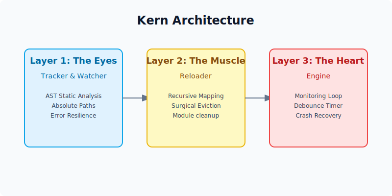

# Project kern: Technical Architecture

## 1. The Vision & Origin
kern was born from a real-world frustration during AI experimentation. While building a terminal-based conversational AI, the need to restart the entire session (and lose conversation context) every time a line of code changed became a bottleneck. This inspired the creation of a reloading system that could update logic on the fly without stopping the running script. Unlike web frameworks that restart the process, kern provides **Surgical Script Reloading**, allowing developers to modify logic and see results immediately in the same terminal session without losing state.

## 2. The Three-Layer Engine Design



### Layer 1: The Eyes (Tracker & Watcher)
*   **Static Analysis via AST**: kern uses Python's `ast` module to map the project's dependency tree. This is safer than importing files to find dependencies, as it avoids executing code during the scanning phase.
*   **Absolute Path Resolution**: Every file monitored is resolved to its absolute path on the disk using `.resolve()`. This ensures that the engine remains consistent even if the user moves between relative directories.
*   **Syntax-Error Resilience**: The tracker is wrapped in try-except blocks. If a file contains a `SyntaxError` during a save, the tracker keeps the file in its "watched" list so it can detect when the error is eventually fixed.

### Layer 2: The Muscle (Reloader)
*   **Recursive Dependent Mapping**: When a file changes, the reloader uses an iterative Stack to identify every "parent" module that depends on that specific file.
*   **System Module Eviction**: kern surgically removes these affected modules from `sys.modules`. This forces Python to perform a clean reconstruction of the logic from the disk rather than pulling stale data from RAM.
*   **Ordered Eviction**: The reloader sorts modules by depth to ensure that children are cleared before parents, maintaining an orderly cleanup of the Python namespace.

### Layer 3: The Heart (Engine)
*   **Persistent Monitoring Loop**: The engine runs a `while True` loop that orchestrates the detection and recovery phases.
*   **Input-Free Hot-Reloading**: Unlike early prototypes that required manual "Enter" prompts, the engine now uses an automated heartbeat to check for changes.
*   **Debounce Stabilization**: A 0.5s debounce timer was implemented. This ensures that if a text editor performs multiple partial saves, kern waits for the "silence" of a completed save before triggering the reload.

## 3. Professional Tooling & Packaging
*   **Custom CLI**: The engine is accessible via the `kern` command, registered through an entry point in `pyproject.toml`.
*   **Co-Authored Metadata**: The tool officially recognizes Emmanuel Obolo Oluwapelumi and Abiodun Kumuyi as the architects in the package metadata.
*   **Editable Installation**: By using `pip install -e .`, the engine is installed as a system-wide tool while remaining linked to the source code for real-time engine development.
*   **Diagnostic Identity**: The `kern info` command provides immediate feedback on the engine version and authorship.

## 4. Key Technical Accomplishments
*   **Framework Independence**: kern operates on pure Python scripts, removing the need for web-server reloaders in non-web projects.
*   **State Integrity**: By evicting parent modules, it prevents the "Ghost Import" problem where updated code is ignored because a parent module already holds an old version in memory.
*   **Low Latency**: Because surgery happens in RAM (via `sys.modules`), it is significantly faster than killing and restarting the Python interpreter.
*   **Error Recovery**: The engine is designed to survive crashes; if the user provides broken code, kern logs the error and waits for the fix, never exiting the loop.

## 5. Quick Start Guide

Go from installation to your first hot-reloaded script in under 60 seconds.

### Installation
Clone the repository and install in editable mode:
```bash
git clone https://github.com/olugbeminiyi2000/Kern.git
cd Kern
pip install -e .
```

### Usage
1.  **Create a python script** (e.g., `app.py`):
    ```python
    def run():
        print("Hello from kern!")
    ```

2.  **Run with kern**:
    ```bash
    kern run app.py
    ```

3.  **Modify `app.py`** while it runs. Change the print statement and save. kern will detect the change, reload the module, and execute `run()` again instantly.

### Commands
*   `kern run <file>`: Start the hot-reload engine on a specific file.
*   `kern info`: Display engine version and author information.

---
**Architects**: Emmanuel Obolo Oluwapelumi & Abiodun Kumuyi

**Status**: Active v0.1.0
