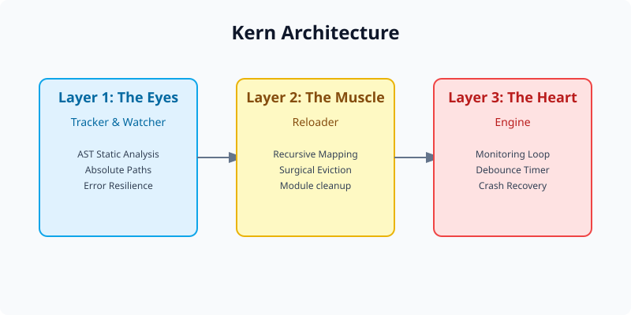

# kern — Surgical Hot-Reloading for Python

kern watches your Python script and every file connected to it. When anything in that graph changes, kern reloads only the affected modules — without restarting your process or losing terminal state.

Built for pure Python scripts where state matters: AI experiments, terminal sessions, long-running tools.

---

## The Problem

Standard hot-reloaders (`flask --debug`, `uvicorn --reload`) restart your entire process. For web servers that is fine. For a terminal-based conversational AI — where you have context loaded, a session established, and hundreds of tokens in memory — a full restart means losing everything.

kern was built to solve this: reload only the code that changed, keep everything else exactly as it was.

---

## How It Works

1. You run `kern run app.py`
2. kern AST-scans `app.py` and follows every local import recursively to build a complete dependency graph of your project
3. kern watches **all** of those files for changes
4. Any file in the graph changes → kern evicts only the affected modules from `sys.modules`, re-imports the entry point fresh, and calls `run()` if present
5. Your process never restarts. State is preserved.

---

## Architecture



### Layer 1 — Scanner (Tracker & Watcher)
- **Static AST Analysis**: kern uses Python's `ast` module to map the full dependency tree without executing any code — safe even when files have syntax errors.
- **Absolute Path Resolution**: Every watched file is resolved to its absolute path via `.resolve()`, keeping the engine consistent regardless of working directory.
- **Syntax-Error Resilience**: The tracker wraps scans in try-except. A file with a `SyntaxError` stays in the watch list — kern recovers automatically when the error is fixed.
- **Daemon Thread Watcher**: FileWatcher runs as a daemon thread, polling modification times every 0.3s. It exits automatically with the main process.

### Layer 2 — Evictor (Reloader)
- **Recursive Dependent Mapping**: When a file changes, the reloader uses an iterative stack to find every module that depends on it — transitively.
- **Surgical `sys.modules` Eviction**: Affected modules are removed from Python's module cache, forcing a clean re-import from disk on the next load.
- **Ordered Eviction**: Modules sorted by path depth so children are cleared before parents — prevents "ghost imports" where a parent holds a stale child reference.

### Layer 3 — Orchestrator (Engine)
- **Persistent Monitoring Loop**: The engine runs a `while True` loop orchestrating detection and reload.
- **Debounce Stabilization**: A 0.5s debounce timer waits for the "silence" after a save before triggering a reload — handles editors that write files in multiple partial flushes.
- **Error Recovery**: Runtime errors in your script are caught, logged to `engine_error.log`, and the engine keeps running — waiting for you to fix the code and save again.

---

## Quick Start

### Installation

```bash
git clone https://github.com/olugbeminiyi2000/Kern.git
cd Kern
pip install -e .
```

**Troubleshooting** (older pip/setuptools environments):

```bash
rm -rf *.egg-info
pip install --upgrade pip setuptools wheel
pip install -e .
```

### Usage

**1. Start kern on your main script**

kern scans the file, builds the dependency graph of every local file it imports, and starts watching all of them.

```bash
kern run app.py
```

**2. Edit any file in the project and save**

Change `app.py`, or any file it imports. kern detects the change, evicts the stale modules, and re-imports fresh.

**3. In your entry script, add `run()` as the re-execution hook (recommended)**

Your helper files (`utils/`, `models/`, etc.) are **completely normal Python** — just define functions, classes, and constants as you always would. No special contract on them.

In the **entry script you pass to kern**, add a `run()` function. Kern calls it explicitly after every successful reload, separate from the import itself.

```python
# utils/greeter.py — normal Python, no run() needed
def greet(name):
    return f"Hello, {name}!"
```

```python
# app.py — entry script with run() hook
from utils.greeter import greet

def run():
    print(greet("World"))
```

**Does kern work without `run()`?**

Yes — kern uses `importlib.reload()` internally, which re-executes all module-level code on every reload. So if your entry script has top-level statements (not inside any function), those run on every reload regardless of `run()`.

The difference is:

| | Module-level code | `run()` hook |
|---|---|---|
| When it executes | Inside the import, during `importlib.reload()` | After import succeeds, called explicitly by kern |
| If it throws | Crashes the import — kern logs `RECONSTRUCTION FAILED` | Import still succeeds, error caught separately |
| Other modules importing yours | Side effects fire on every import | Side effects contained to kern's explicit call |
| Output ordering | Code runs before `[*] reconstructed successfully.` | Code runs after the success message |

`run()` is the recommended pattern because it isolates execution from import, follows Python convention (no side effects at module level), and gives kern a clear re-entry point. But kern will still reload and re-run module-level code if `run()` is absent — it just prints a warning.

**Note on blocking operations:** kern runs your code synchronously. If `run()` blocks on `input()` or a network request, the engine cannot process new file changes until that call returns. The FileWatcher still detects changes in the background — they are applied as soon as control returns to the main loop.

### Commands

| Command | Description |
|---|---|
| `kern run <file>` | Start the hot-reload engine on a Python script |
| `kern info` | Display version and author information |

---

## Configuration

kern's timing is controlled by hardcoded values in the source. The only one exposed as an instance attribute (editable at runtime) is:

| Value | Location | Default | Description |
|---|---|---|---|
| `DEBOUNCE_SECONDS` | `core/engine.py` | `0.5s` | Wait time after the last file change before reloading |

The file polling interval (`0.3s` in `tracker/watcher.py`) and heartbeat sleep (`0.1s` in `core/engine.py`) are hardcoded.

---

## Key Technical Accomplishments

- **Framework Independence**: Works on pure Python scripts — no web server required.
- **State Integrity**: Evicting parent modules prevents the "Ghost Import" problem where updated child code is silently ignored because the parent holds an old cached version.
- **Low Latency**: Module surgery happens in RAM via `sys.modules`. No interpreter restart, no process fork.
- **Error Recovery**: kern never exits on user code errors — it waits for a fix.

---

## Professional Tooling

- **Custom CLI**: Registered via `entry_points` in `pyproject.toml` — `kern` is available system-wide after `pip install -e .`
- **Editable Install**: Source changes to kern itself are reflected immediately without reinstalling.
- **Diagnostic Command**: `kern info` shows version and authorship at a glance.

---

**Architects**: Emmanuel Obolo Oluwapelumi & Abiodun Kumuyi  
**Status**: Active — v0.1.0
